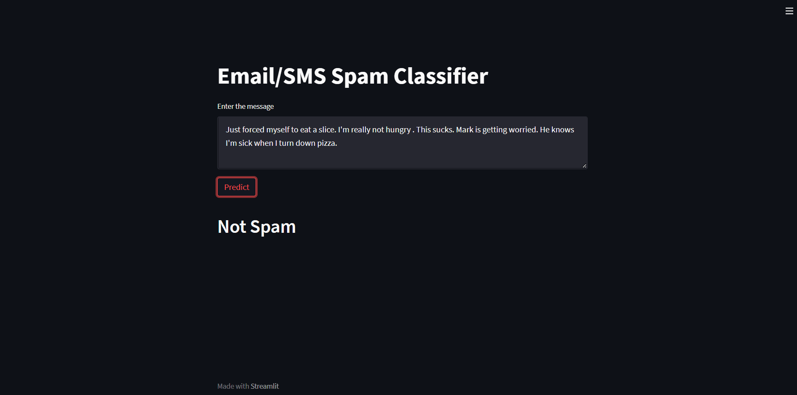

# Email / SMS Spam Classification app

In this data science project we have created spam classification website. We will first build a model using nltk and SVM using mail_data from kaggle.com. Secondly we used streamlit to create a web API.


## Technologies used in the project

1. Python
2. Numpy and OpenCV for data cleaning
3. Matplotlib & Seaborn for data visualization
4. NLTK for text processing 
5. Sklearn for model building
7. Jupyter notebook, visual studio code and pycharm as IDE
8. Streamlit
## Installation

The Code is written in Python 3.6.10. If you don't have Python installed you can find it here. If you are using a lower version of Python you can upgrade using the pip package, ensuring you have the latest version of pip. To install the required packages and libraries, run this command in the project directory after cloning the repository:

```bash
pip install -r requirements.txt
```
    
## Deployement on Heroku

Login or signup in order to create virtual app. You can either connect your github profile or download ctl to manually deploy this project.

[](https://heroku.com)

Our next step would be to follow the instruction given on [Heroku Documentation](https://devcenter.heroku.com/articles/getting-started-with-python) to deploy a web app.
## Future Scope

* Intergration to different APIs
 

